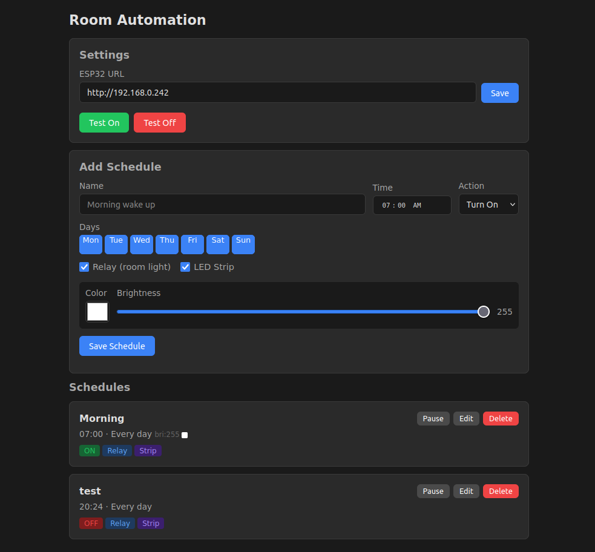

# ESP32 Room Controller Automation

Schedule-based automation server for the [ESP32 Room Controller](https://github.com/gustavomoura628/esp32-room-controller). Schedules on/off commands to the room light relay and WS2813 LED strip at set times and days.



## Features

- **Time-based scheduling** -- set on/off times for the relay (room light) and LED strip
- **Day selection** -- per-schedule weekday picker (every day, weekdays, weekends, or custom)
- **Strip controls** -- color and brightness per schedule (for "on" actions)
- **Enable/pause** -- toggle schedules without deleting them
- **Test buttons** -- manually fire on/off to verify ESP32 connectivity
- **ESP32 URL config** -- set from the web UI, no config files needed
- **Survives reboots** -- runs as a systemd service

## How it works

The server polls no state -- it fires HTTP requests to the ESP32's web API at scheduled times:

- **Relay**: checks `/relaystatus` first, only calls `/relay` (toggle) if the current state differs from the desired state
- **Strip**: calls `/strip?on=1&brightness=X&r=R&g=G&b=B` for on, `/strip?on=0` for off

Schedules are stored in SQLite (`automation.db`, auto-created on first run) and loaded into APScheduler as cron jobs.

## Requirements

- Python 3
- Network access to the ESP32

## Setup

```bash
# Clone and enter the project
git clone https://github.com/gustavomoura628/esp32-room-controller-automation.git
cd esp32-room-controller-automation

# Create venv and install dependencies
python -m venv venv
source venv/bin/activate
pip install -r requirements.txt

# Run
python server.py
```

The web UI is at `http://localhost:5000`. Set your ESP32's IP in the Settings section.

## systemd service (auto-start on boot)

A service file is included. To install it:

```bash
# Symlink the service file
sudo ln -sf $(pwd)/esp32-automation.service /etc/systemd/system/esp32-automation.service

# Reload, enable, and start
sudo systemctl daemon-reload
sudo systemctl enable --now esp32-automation.service
```

The service will start on boot and restart on crash (5s delay).

Useful commands:

```bash
sudo systemctl status esp32-automation     # check status
sudo systemctl restart esp32-automation    # restart
sudo systemctl stop esp32-automation       # stop
journalctl -u esp32-automation -f          # tail logs
```

**Note:** edit `esp32-automation.service` and replace `YOUR_USER` and `/path/to/esp32-room-controller-automation` with your actual user and project path before installing.

## API

| Method | Path | Description |
|--------|------|-------------|
| GET | `/` | Web UI |
| GET | `/api/schedules` | List all schedules |
| POST | `/api/schedules` | Create a schedule |
| PUT | `/api/schedules/<id>` | Update a schedule |
| DELETE | `/api/schedules/<id>` | Delete a schedule |
| GET | `/api/config` | Get config |
| POST | `/api/config` | Save config |
| POST | `/api/test/on` | Test fire "on" action |
| POST | `/api/test/off` | Test fire "off" action |

## Tech

- **Flask** -- web server and API
- **APScheduler** -- cron-based job scheduling
- **SQLite** -- schedule and config persistence
- **Requests** -- HTTP calls to ESP32
- Vanilla JS frontend, no build step
